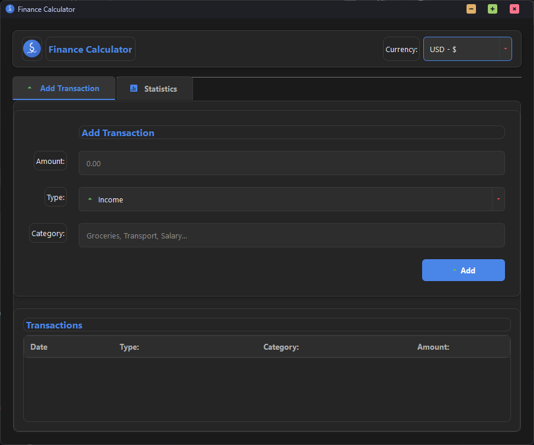

# 💰 Finance Calculator

<div align="center">


[](requirements.txt)
[](LICENSE)

**Modern personal finance management tool with a dark-themed interface**



</div>

## ✨ Key Features

- 💸 **Track Income & Expenses**
  - Add, edit, and delete transactions
  - Categorize your spending
  - Support for 20 major world currencies

- 📊 **Visual Analytics**
  - Expense breakdown pie charts
  - Balance trend analysis
  - Real-time data updates

- 🌐 **Multi-Currency Support**
  - USD ($), EUR (€), GBP (£)
  - JPY (¥), CNY (¥), RUB (₽)
  - And many more!

- 🎨 **Modern Design**
  - Stylish dark theme
  - Shadow effects and animations
  - Beautiful icons and charts

- 🎯 **User-Friendly Interface**
  - Intuitive design
  - Easy transaction management
  - Right-click context menus

## 🚀 Installation

1. Clone the repository
```bash
git clone https://github.com/FodiYes/FinanceCalc.git
cd FinanceCalc
```

2. Install required packages
```bash
pip install -r requirements.txt
```

3. Run the application
```bash
python finance_calculator.py
```

## 📖 Usage

### Adding Transactions
1. Select transaction type (Income/Expense)
2. Enter amount
3. Choose category
4. Click "Add" to save

### Managing Transactions
- **Right-click** on any transaction to:
  - ✏️ Edit details
  - 🗑️ Delete entry

### Viewing Statistics
- 📊 Click "Show Expenses by Category" for pie chart
- 📈 Click "Show Balance Trend" for balance history

### Currency Selection
- 🌐 Choose your preferred currency from the dropdown
- 💱 All transactions will display in the selected currency

## 💾 Data Storage

All your financial data is:
- Saved in JSON format
- Persists between sessions
- Securely stored locally

Each transaction includes:
- 📅 Date and time
- 💰 Type (Income/Expense)
- 🏷️ Category
- 💵 Amount
- 🌐 Currency

## 🖥️ Technical Details

- Built with **Python**
- UI powered by **PyQt6** (previously Tkinter)
- Charts created with **Matplotlib**
- Data handling with **Pandas**
- Dark theme for comfortable use at any time of day

## 🤝 Contributing

Contributions are welcome! Feel free to:

1. Fork the repository
2. Create a new branch
3. Make your changes
4. Submit a pull request

## 📝 License

This project is licensed under the MIT License - see the [LICENSE](LICENSE) file for details.

---

<div align="center">

**Made with ❤️ by DAN**

If you find this project helpful, please give it a ⭐️!

</div>
